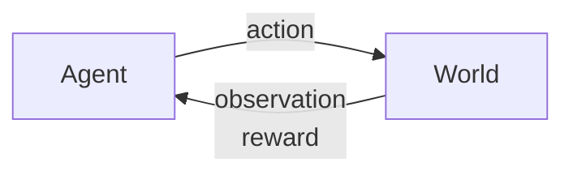

# Reinforcement Learning
Learning through experience/data to make **good decisions** under uncertainty.

The central idea is to learn by **interacting with an environment** to **maximize cumulative rewards** over time.

*How to make good decisions* has been a key question in AI and decision theory since 1950s. It was influenced by Richard **Bellman's equation**, which is a fundamental **part of optimization in RL**.

RL has seen notable success in the last decade, as in [AlphaGo](https://www.nature.com/articles/nature24270).

And also on our friend [ChatGPT](https://www.chatgpt.com).

![[chatgpt.png]]

The key elements of RL are:
- **Optimization**: finding the best way to make decisions
- **Delayed Consequences**: understanding that decisions now can impact future outcomes
- **Exploration**: learning by trying new actions and gathering information
- **Generalization**: applying past learning to make decisions in new, unseen situations
## Optimization
We use some explicit notion of decision **utility**.

In RL, it refers to a measure of **how good an agent's decisions are over time**, and is typically defined as the cumulative rewards the agent receives by following a particular **policy**.

The **goal in RL** is to find the **best possible policy** to **maximize utility**.
## Delayed Consequences
Current decisions can have long-term effects.

There are two **challenges**:
- when **planning**, we have to **reason** not only about immediate benefit of a decision but also its **long-term impact** (think of it as **ramifications** on a tree)
- when **learning**, we have to understand which actions in the past contributed to rewards or outcomes much later (**temporal credit assignment**)
## Exploration
In RL, an agent learns **only by trying**.

Every outcome of an action serves as experience, so **the agent must explore different actions** to understand their outcomes.

**Decisions** impact **what we learn about**.

It is important to balance **exploration** and **exploitation**.
## Generalization
The policy learned is a **mapping from past experiences to decisions**.

This decisions must be good for new, similar situations.
# RL vs Other AI and ML
We will compare Reinforcement Learning against AI Planning, Supervised Learning, Unsupervised Learning and Imitation Learning.

|                        | AI Planning | SL  | UL  | RL  | IL  |
| :--------------------: | :---------: | :-: | :-: | :-: | :-: |
|      Optimization      |      X      |     |     |  X  |  X  |
| Learns from experience |             |  X  |  X  |  X  |  X  |
|     Generalization     |      X      |  X  |  X  |  X  |  X  |
|  Delayed Consequences  |      X      |     |     |  X  |  X  |
|      Exploration       |             |     |     |  X  |     |
- **AI Planning** assumes have a model of how decisions impact environment
- **SL** has access to the correct labels
- **UL** has access to no labels
- **IL** typically assumes input demonstrations of good policies
# Two Problem Categories where RL is Powerful
1. **No examples of desired behavior exist**: when we want to model to have superhuman performance as there is no pre-existing data for that (e.g., AlphaGo)
2. **Complex search of optimization problems w/ delayed outcomes**: when the problem has a vast search space and delayed rewards (e.g., [AlphaTensor](https://deepmind.google/discover/blog/discovering-novel-algorithms-with-alphatensor/))
# Refresher Exercise
## Problem
- the student initially does not know either addition (easier) or subtraction (harder)
- the AI tutor agent can provide practice problems on addition or subtraction
- the agent gets rewarded +1 if the student gets the problem right and -1 if he gets it wrong
## Task
Model this as a **Decision Process**. Define state space, action space and reward model. what does the dynamics model represent? what would a policy to optimize the expected discounted sum of rewards yield?
## Solution
### State
represent the student's knowledge level. i can be represented as:
- **history**: a sequence of past interactions
$$ (observation, question, answer, reward, ...) $$
- **proficiency levels**: a score or probability representing the student's skill in addition and subtraction
$$ (addition=0.4, subtraction=0.9) $$
### Actions
- `give_addition_question`
- `give_subtraction_question`
### Reward Model
- $+1$ if the answer is correct
- $-1$ if the answer is incorrect
### Dynamics model
represents how the student's **state changes after each question**. for instance, if the student answers correctly, his proficiency in that topic may increase.

the dynamics model **predicts these changes in knowledge** based on the interactions.
#### *Challenge*
there is a risk that the agent may exploit the reward system by providing only addition problems, as addition is easier. this might become an easier way to maximize rewards, but it won't truly help the student on learning both skills.

this is an example of **reward hacking**, which happens when the agent maximizes the given reward but not the actual learning objective.
### Optimal Policy
help the student learn both skills by **gradually introducing more subtraction problems** as addition proficiency improves, **maximizing long-term reward** by balancing learning gains in both topics
# Sequential Decision Making
It involves choosing actions at each step to maximize total expected future rewards. In RL, this requires balancing immediate and long-term rewards.

At each time step $t$:
- agent takes an action $a_t$
- world updates given action $a_t$, emits observation $o_t$ and reward $r_t$
- agent receives observation $o_t$ and reward $r_t$

Based on it we can identify a history
$$ h_t=(a_1, o_1, r_1, ..., a_t, o_t, r_t) $$
and a state as the information assumed to determine what happens next.
$$ Function\ of\ history:\ s_t=(h_t) $$
# Markov Assumption
It states that **the future only depends on the present state, not on the full history of past events**.

In other words, it means that in a Markov Assumption it is **only needed to know the current state** to predict a next state.
$$ p(s_{t+1}|s_t,a_t) = p(s_{t+1}|h_t, a_t) $$
This is helpful because it allows RL agents to focus on the current state instead of the entire history, reducing complexity.
## Why is Markov Assumption Popular?
Because it **simplifies decision-making** as only most recent observations are sufficient statistic of history: $s_t=o_t$

State representation has big implications for:
- computational complexity
- data required
- resulting performance
## Types of Markov Models
### Markov Chain
**Memoryless random process**. Just a random sequence of states with Markov property. **No actions. No rewards.**
#### **Formal definition**
- $S$ is a (finite) set of state $(s\in S)$
- $P$ is dynamics/transition model that specifies $p(s_{t+1}=s'|s_t=s)$

If finite number of states, $P$ can be expressed as a matrix.
$$
P = 
\begin{pmatrix}
P(s_1 | s_1) & P(s_2 | s_1) & \cdots & P(s_N | s_1) \\
P(s_1 | s_2) & P(s_2 | s_2) & \cdots & P(s_N | s_2) \\
\vdots & \vdots & \ddots & \vdots \\
P(s_1 | s_N) & P(s_2 | s_N) & \cdots & P(s_N | s_N)
\end{pmatrix}
$$
#### **Example: Weather Prediction**
If today's weather is *sunny*, a Markov Chain model might predict tomorrow's weather based solely on the probability of transitions from *sunny* to other states like *rainy* or *cloudy*.

There are just $3$ states:
$$
P = 
\begin{pmatrix}
P(\text{sunny}|\text{sunny}) & P(\text{cloudy}|\text{sunny}) & P(\text{rainy}|\text{sunny}) \\
P(\text{sunny}|\text{cloudy}) & P(\text{cloudy}|\text{cloudy}) & P(\text{rainy}|\text{cloudy}) \\
P(\text{sunny}|\text{rainy}) & P(\text{cloudy}|\text{rainy}) & P(\text{rainy}|\text{rainy})
\end{pmatrix}
$$
And these are the probabilities:
$$
P = 
\begin{pmatrix}
0.6 & 0.4 & 0 \\
0.4 & 0.2 & 0.4 \\
0 & 0.4 & 0.6 \\
\end{pmatrix}
$$
The state space can be represented with the following diagram:

![[weather.png|400]]
### Markov Reward Process
**Markov Chain + rewards**, so now the goal is to maximize cumulative rewards over time. Still **no actions**.
#### **Formal definition**
- $S$ is a (finite) set of state $(s\in S)$
- $P$ is dynamics/transition model that specifies $p(s_{t+1}=s'|s_t=s)$
- R is a reward function $R(s_t=s)=E[r_t|s_t=s]$, which denotes the immediate rewards an agent gets by being in state $s$
- discount factor $\gamma \in[0, 1]$ which determines the importance of future rewards relative to immediate rewards

> [!note]
> In MRPs, the reward (in this case the random variable $r_t$) may be **stochastic**, meaning it can vary each time state $s$ is reached. The **expected value operator** $(\mathbb{E}[\cdot])$ is used to represent the **average reward** the agent would expect over many encounters with the state $s$. This expectation is crucial for modeling real-world scenarios where outcomes can vary due to randomness, making it **easier to optimize and plan** without having to treat each individual visit as a completely new, unrelated outcome.

If finite number of states, $R$ can be expressed as a vector.
#### **Example: Game Score**
A player passes trough different rooms (states) with rewards in each. An MRP can track cumulative points based on transitions trough rooms.

If 6 rooms, we have 6 states. The vector R would be:
$$ R=(+1, 0, 0, 0, 0, +10) $$
- In $s_1$ (room 1), there is a reward of $+1$
- In $s_6$ (room 6) there is a reward of $+10$
- In others the reward is $0$
### Markov Decision Process
**MRP + actions/decisions**, so now the goal is to find the best actions that maximize the cumulative rewards over time. This implies **taking good decisions**.

![[01.jpg]]

## *Example: Mars Rover as a MDP*
States: location of rover $(s1, ..., s_t)$
Actions: TryLeft or TryRight
Rewards;
- $+1$ in state $s_t$
- $+10$ in state $s_t$
- $0$ in all other states

control trial and error to find the best policy

evauationÑ testing a policy

a value is e expected retrur

math convenint
future reward less than immedaite rewards

gama equal 1

infite horions less than 1

rewards dont blow up

